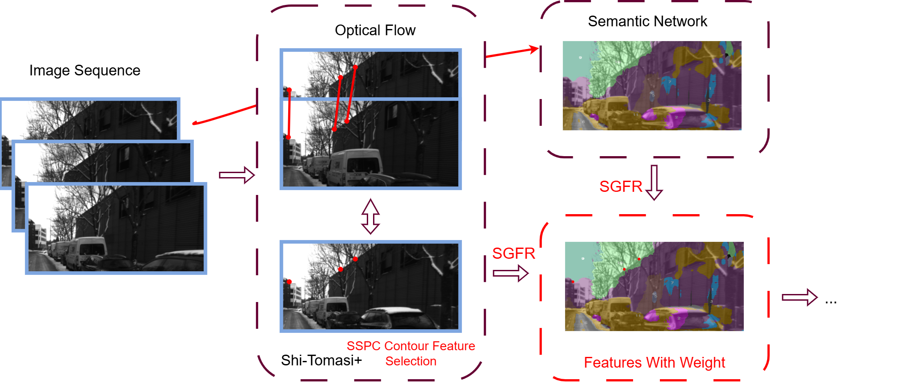

# A lightweight and robust visual odometry implemented purely in Python on CPU
 We introduce a pipeline with **robust front-end**:

 

To achieve real‑time performance in a Python CPU‑only environment, we recover camera pose using the essential matrix rather than maintaining landmarks and performing bundle adjustment. Nevertheless, the front‑end pipeline can be readily integrated into VINS-style systems.
